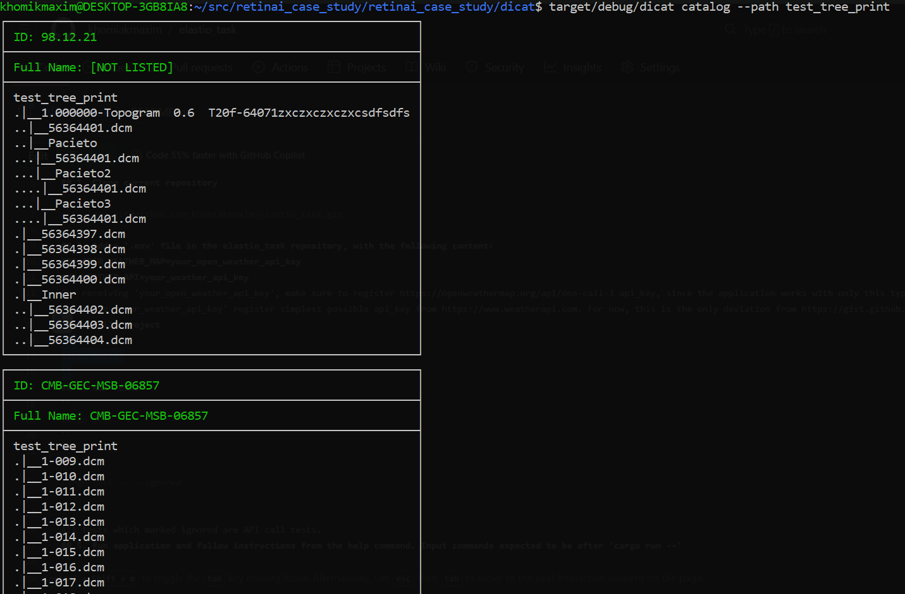
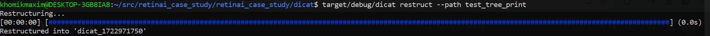

# Dicat — DICOM Catalog Utility
Command line utility that catalogs DICOM files

# Usage
## 1. Build the project
``
cargo b
``

## 2. Run tests
``
cargo t
``

## 3. Run with `--help` for useful information
``
target/debug/dicat --help
``

## 4. Try to run `catalog` command on a directory, which contains `DICOM` files
``
target/debug/dicat catalog --path 
``

For each patient which `DICOM` files were in the original folder, a rectangle with original directory sub-tree will be printed to the console

## 5. You can choose a subset of patients via providing `--ids` option and listing patient's IDs separated by `,`

``
target/debug/dicat catalog --path --ids ID1,ID2
``

## 6. You also have an option to print information about the `DICOM` files in the directory in the `.csv` format, which preserves the original hierarchy of the directory
``
target/debug/dicat catalog --path --as-csv
``

You can use this with `pipes`, when running on `Unix`-like systems 

## 7. You can also restructure the `DICOM` files from the directory into a new one, which will contain separate directories for each patient with their `DICOM` files directly in them
``
target/debug/dicat restruct --path
``

You can even check the structure of the newely created directory via the `catalog` command

# Design issues
* At this point, there's no possibility to provide a path to the directory where you want to `restruct` your file to

# Codebase issues
* It would be better to decouple parts, which scaffold the `catalog` structure, and which print it to the stdout by introducing a trait similar to `WriteTree`. Currently, that would require a codebase to be refactored
* The amount of `tokio` tasks which copy files into the newely created directory when using `restruct` is currenlty hardcoded to be `4`. It's the smallest amount of async I\O tasks, which use the maximum throughput of my SSD. 
  It would be better to either dynamically deduce this number, or, at least, provide a possibility to overwrite it via the argument or tne environment variable
* On Windows `indicatif` progress bar isn't shown

# Dependency notes:
* For directory traversal I use `walkdir` for sequential and `jwalk` for parallel cases. Since both of them aren't widely known and are currently only being supported, I'd consider to fork them and work with the forked versions, in order to avoid possible issues in the future
* For retreiving information about each patient I use `dicom` crate, which loads the entire contents of the file into the memory, which is not currently necessary

# Environment
It has been tested on both Linux(Ubuntu 22.04) and Windows 10.

# Scaling
40 GiB directory, filled with all `.DICOM` files with disabled file system cache takes:
* `40s` for `target/release/dicat catalog` (this can be improved by reading only necessary information from `DICOM` file)
* `4m17s` for `target/release/dicat restuct`

Since all algorithms are linearly dependent from the amount of the files in directory and their size, performance must scale reasonably well
